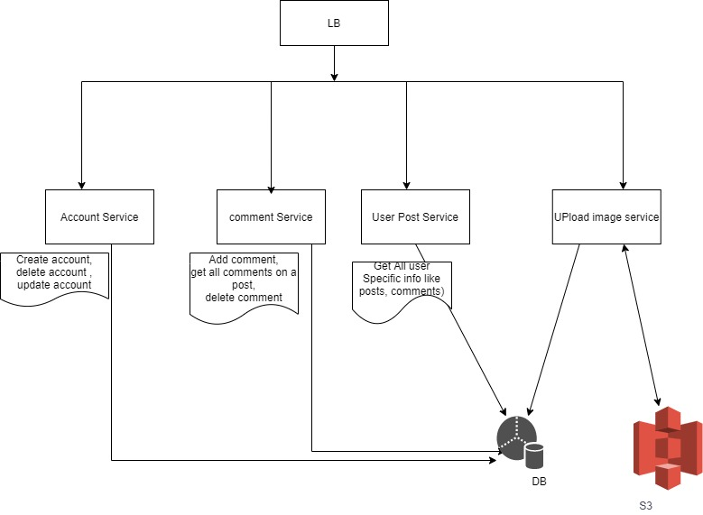
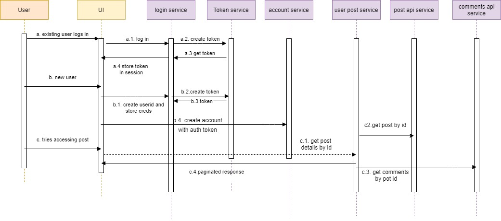

# IMAGEGRAM SYSTEM : WORK IN PROGRSS 
Basic block diagram for system  

  
  

----

## High Level Blocks' Explaination

 1. **Account service**: The service deals with the account CRUD operations.
 2. **Image Upload service**: The service deals image upload. The service is made a different mciroservice, considering the read to write ratio and since, image upload will be heavy operation, the process should not impact the latency of read operation whose volume will be higher than upload operation.
 3. **User Post service**: The service deals with all get operations or the operations, which needs nested response all user post related operations like get all posts, get all users, get all comments related to post.
 4. **Comment service**: The service deals with the comment CRUD operations
 5. **Post API service**: The service deals with the image post specific CRUD operations.
 6. **Token service**: The service deals with the token creation/validation which is responsible for header validation.
----
## Assumptions:
 1. The SSO login service already exists and upon login it issues token and stores in the session.
 2. For new sign up, once credentials are created and stored, it will share the username/userid to be stored with the account. (Account API will only store the account details in the DB along with assoicated userid).
----
 ## Sequence diagram:
 Below diagram is to give the high level idea of sequence flow for the system 
 

  
  

----
 ## Current covered scenarios:
  1. A user can create account, the account creation will be validated with the header.
  2. A user can get the post and all comments related to it in paginated format.

 ---- 

  Please NOTE :the system is using mock implementations of adapters and stores right now. 
   The readme will be updated once the developement is completed.
----
